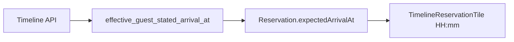

# Očekivano vrijeme dolaska na timeline kartici

## Cilj

Za rezervacije sa statusom **`expected`**, u redu s ikonama (lijevo eVisitor, desno status/sat) prikazati **vrijeme dolaska** npr. `15:00` — kao na screenshotu za Simone Gabbia (tue 16.06.).

Vrijeme dolazi iz rezervacije:
- ako gost naveo dolazak → `guest_stated_arrival_at`
- ako nije → property **`check_in_time`** na datum `check_in` (isto kao [`effective_guest_stated_arrival_at`](stay.hr/backend/apps/core/timezone.py) na backendu)

## Backend (mali dodatak)

[`ReservationTimelineSerializer`](stay.hr/backend/apps/api/reception_serializers.py) već izlistava `guest_stated_arrival_at` / `guest_stated_arrival_text`, ali Flutter ih ne koristi i raw `guest_stated_arrival_at` je često `null`.

Dodati read-only polje:

- `expected_arrival_at` — `SerializerMethodField` → `effective_guest_stated_arrival_at(obj)` formatiran kao ISO datetime (Django `DateTimeField` serializacija)
- U `Meta.fields` dodati `expected_arrival_at` (pored postojećih guest_stated polja)

Nema migracije. Deploy stay.hr nakon pusha (isti workflow kao ostale API izmjene).

## Flutter model

U [`reservation.dart`](uzorita_flutter/lib/features/reception/domain/reservation.dart):

- Nova opcionalna polja: `guestStatedArrivalAt`, `guestStatedArrivalText`, `expectedArrivalAt` (ISO string iz API-ja)
- `fromJson`: mapirati `guest_stated_arrival_at`, `guest_stated_arrival_text`, `expected_arrival_at`
- Getter ili helper u novom malom fajlu [`timeline_expected_arrival.dart`](uzorita_flutter/lib/features/reception/presentation/timeline_expected_arrival.dart):

```dart
String? timelineExpectedArrivalHm(Reservation r) {
  if (r.status.trim().toLowerCase() != 'expected') return null;
  final raw = r.expectedArrivalAt ?? r.guestStatedArrivalAt;
  if (raw == null || raw.isEmpty) return null;
  final dt = DateTime.tryParse(raw);
  if (dt == null) return null;
  // HH:mm u lokalnom prikazu parsed datetime-a
  return ...
}
```

Ažurirati test factory-e koji grade `Reservation(...)` samo ako nedostaju required args (nova polja default `''`).

## UI — [`timeline_reservation_tile.dart`](uzorita_flutter/lib/features/reception/presentation/timeline_reservation_tile.dart)

U header `Row` (ikone desno od imena), redoslijed:

1. unread badge (ako ima)
2. eVisitor ikona (ako `complete` / `incomplete`)
3. **novo:** ako `timelineExpectedArrivalHm(r) != null` → `Text` s monospace / `labelMedium`, boja `onSurfaceVariant`, padding `right: 6`; opcionalni `Tooltip` s `guestStatedArrivalText` ako postoji, inače l10n „Očekivani dolazak {time}”
4. status ikona (expected sat)

Prikaz **samo** za `expected`, ne za `checked_in` / ostale statuse.

## L10n

U [`tool/l10n/strings.json`](uzorita_flutter/tool/l10n/strings.json):

- `timelineExpectedArrivalTooltip` — npr. „Očekivani dolazak: {time}” (param `{time}`)
- Opcionalno: `timelineExpectedArrivalGuestStated` — tooltip kad postoji `guest_stated_arrival_text`

`python tool/gen_arb.py` + `flutter gen-l10n`.

## Testovi

- [`timeline_expected_arrival_test.dart`](uzorita_flutter/test/features/reception/timeline_expected_arrival_test.dart): format HH:mm iz ISO; `null` za non-expected; fallback `expectedArrivalAt` vs `guestStatedArrivalAt`
- Ažurirati postojeće `Reservation(...)` u testima ako treba (default prazni stringovi)

## Deploy

1. **stay.hr:** commit + deploy (`expected_arrival_at` na timeline API)
2. **uzorita_flutter:** commit + push; `flutter run` / release build za provjeru na uređaju


