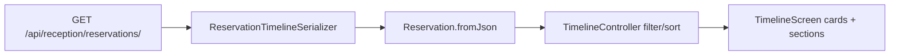
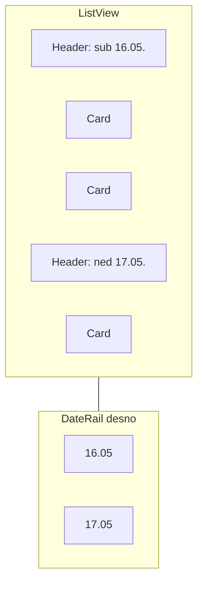

# Timeline: ikone, više soba, Sutra, dnevni razdjelnici

## Stanje danas

**Backend** ([`serializers.py`](c:\Users\avrca\Documents\Projects\Uzorita_all\uzorita-rooms-code\backend\app\reception\serializers.py)) već vraća za listu:

- `units_count`, `persons_count`, `children_count`, `payment_status`
- `units[]` (`ReservationUnitSerializer`: `room_name`, `room_code`, …)
- `room_name` (spojeni nazivi soba preko [`joined_room_names`](c:\Users\avrca\Documents\Projects\Uzorita_all\uzorita-rooms-code\backend\app\reception\reservation_units.py))
- `guests_count` (registrirani gosti u sustavu — **ne** isto što `persons_count` iz Bookinga)

[`ReservationTimelineListView`](c:\Users\avrca\Documents\Projects\Uzorita_all\uzorita-rooms-code\backend\app\reception\views.py) već prefetcha `units` i podržava `check_in_from` / `check_in_to` (Flutter ih još ne šalje).

**Flutter** ([`reservation.dart`](c:\Users\avrca\Documents\Projects\Uzorita_all\uzorita_flutter\lib\features\reception\domain\reservation.dart), [`timeline_screen.dart`](c:\Users\avrca\Documents\Projects\Uzorita_all\uzorita_flutter\lib\features\reception\presentation\timeline_screen.dart)) parsira samo osnovna polja i kartica prikazuje `primaryGuestName (guestsCount)` + ISO datume `YYYY-MM-DD`.



---

## 1. Backend (minimalno)

Nije potrebna promjena modela — polja su na [`Reservation`](c:\Users\avrca\Documents\Projects\Uzorita_all\uzorita-rooms-code\backend\app\reception\models.py).

**Preporučene male dorade** (opcionalno, ali korisno za ikone):

| Dodatak | Razlog |
|--------|--------|
| `SerializerMethodField` `effective_units_count` | `max(units_count, len(units))` kad XLS i stvarni `units` nisu usklađeni |
| `payment_status_key` (npr. `booking`, `property`, `unknown`) | Stabilna mapa na ikone; izvorni `payment_status` ostaje za tooltip (npr. „Naplata putem Booking.com-a”) |
| `children_ages` u timeline serializeru | Tooltip uz ikonu djece |

Ako ne želimo backend enum, mapiranje `payment_status` može biti **samo na klijentu** (heuristika po podstringu `booking`, `plać`, …).

**Prefetch:** u `get_queryset` dodati eksplicitno `"units"` u `prefetch_related` (uz postojeće `units__room`) radi predvidljivog redoslijeda.

---

## 2. Flutter — domena i API

### Proširiti [`Reservation`](c:\Users\avrca\Documents\Projects\Uzorita_all\uzorita_flutter\lib\features\reception\domain\reservation.dart)

Nova polja iz JSON-a:

- `unitsCount` ← `units_count` ili `effective_units_count`
- `personsCount` ← `persons_count`
- `childrenCount` ← `children_count`
- `paymentStatus`, opcionalno `paymentStatusKey`
- `List<ReservationUnit> units` (id, roomName, roomCode)
- Zadržati `guestsCount` samo ako treba negdje drugdje; **ne prikazivati na timeline kartici**

Mali model `ReservationUnit` u istom fileu ili `reservation_unit.dart`.

### [`reception_api.dart`](c:\Users\avrca\Documents\Projects\Uzorita_all\uzorita_flutter\lib\features\reception\data\reception_api.dart)

Proširiti `reservations()` s opcionalnim `checkInFrom` / `checkInTo` (ISO datumi) — koristiti postojeće query parametre backenda za modove Danas/Sutra (manji payload od 475 rezervacija).

---

## 3. Flutter — filter „Sutra“

U [`timeline_controller.dart`](c:\Users\avrca\Documents\Projects\Uzorita_all\uzorita_flutter\lib\features\reception\presentation\timeline_controller.dart):

- Novi `OverviewMode.todayAndTomorrow` (ili `todayPlusTomorrow`)
- **`Danas`**: `check_in` u `[today, today+1)` — kao sada
- **`Sutra`**: `check_in` u `[today, today+2)` — prikaz **danas + sutra** (oba dana dolazaka u jednom pregledu)
- `period.label`: npr. „Danas i sutra“
- Ažurirati `summary` (dolasci/odlasci) da koristi isti interval kao filter

U [`timeline_screen.dart`](c:\Users\avrca\Documents\Projects\Uzorita_all\uzorita_flutter\lib\features\reception\presentation\timeline_screen.dart): `ChoiceChip` **„Sutra“** odmah desno od **„Danas“** (redoslijed chipova: Danas, Sutra, Tjedan, Mjesec, Sve).

---

## 4. Format datuma (hr)

Novi helper npr. [`lib/core/utils/reservation_date_format.dart`](c:\Users\avrca\Documents\Projects\Uzorita_all\uzorita_flutter\lib\core\utils\reservation_date_format.dart) s `intl` + locale `hr`:

| Uvjet | Format | Primjer |
|-------|--------|---------|
| godina == tekuća | `EEE dd.MM.` | `sub 16.05.` |
| inače | `dd.MM.yy` | `16.05.26` |

Koristiti za: raspon na kartici, **zaglavlja dana**, desni scroll indikator.

---

## 5. Nova kartica rezervacije (ikone, malo teksta)

Izdvojiti widget npr. `timeline_reservation_tile.dart`:

```
[ zastava ]  Ime Prezime                    [status]
             external_id
             room_name (skraćeno ako >1 soba)
             [bed n] [persons n] [child n?] [payment icon]
             sub 16.05. → ned 17.05.
```

**Ikone (broj u badge ili pored ikone):**

| Podatak | Ikona | Pravilo |
|---------|-------|---------|
| `unitsCount` | `Icons.bed_outlined` ili `meeting_room` | prikaži ako `> 0` |
| `personsCount` | `Icons.people_outline` | prikaži ako `> 0` |
| `childrenCount` | `Icons.child_care_outlined` | **samo ako `> 0`**, s brojem |
| `payment_status` | `Icons.payments_outlined` / `credit_card` / Booking heuristika | boja po „plaćeno/ne“; **tooltip** = puni string |

Ukloniti `(guestsCount)` iz naslova. Više soba: `room_name` već dolazi spojen; uz `unitsCount > 1` tooltip na ikoni soba s popisom iz `units[].roomName`.

---

## 6. Razdjelnici po danima (break line)

Nakon sorta po `checkInDate` u controlleru:

- Grupirati u `Map<String, List<Reservation>>` po `check_in_date`
- U listi renderirati **zaglavlje dana** + `Divider`:
  - tekst: formatirani datum (`sub 16.05.`)
  - opcionalno mali broj dolazaka tog dana

Implementacija: `CustomScrollView` + `SliverList` **ili** flat `ListView` s `Column` (header + kartice) — jednostavnije za početak.

---

## 7. Desna vremenska linija pri scrollu

**V1 (preporučeno):** uski **date rail** desno (≈36–44 px), overlay na `Stack`:

- Popis jedinstvenih datuma u trenutnom filteru (isti redoslijed kao sekcije)
- `ScrollController` + `NotificationListener`: koja je sekcija najbliža vrhu → **highlight** datuma na railu
- Tap na datum na railu → `Scrollable.ensureVisible` / `scrollTo` na ključ sekcije (`GlobalKey` po danu)

**V2 (kasnije):** prava „timeline“ crtica s točkama na pozicijama — zahtijeva mjerenje visina kartica; rail je dovoljan za UX iz zahtjeva.



---

## Datoteke za izmjenu (sažetak)

| Repo | Datoteke |
|------|----------|
| **uzorita_flutter** | `domain/reservation.dart`, `data/reception_api.dart`, `presentation/timeline_controller.dart`, `presentation/timeline_screen.dart`, novi `timeline_reservation_tile.dart`, `reservation_date_format.dart` |
| **uzorita-rooms-code** (opc.) | `serializers.py`, `views.py` (prefetch `units`) |

---

## Test plan (ručno)

1. **Danas** — samo rezervacije s `check_in` = danas; jedan dan u listi.
2. **Sutra** — dolasci za danas **i** sutra; dva dnevna zaglavlja + rail s 2 datuma.
3. Kartica s `units_count=2`, `children_count=2` — prikaz ikona soba, osoba, djece; bez djece ikona se ne prikazuje.
4. Datum u tekućoj godini: `sub 16.05.`; rezervacija sljedeće godine: `16.05.27`.
5. Scroll — highlight na desnom railu prati vidljivi dan.
6. Rezervacija s više `units` — `room_name` i tooltip soba.
