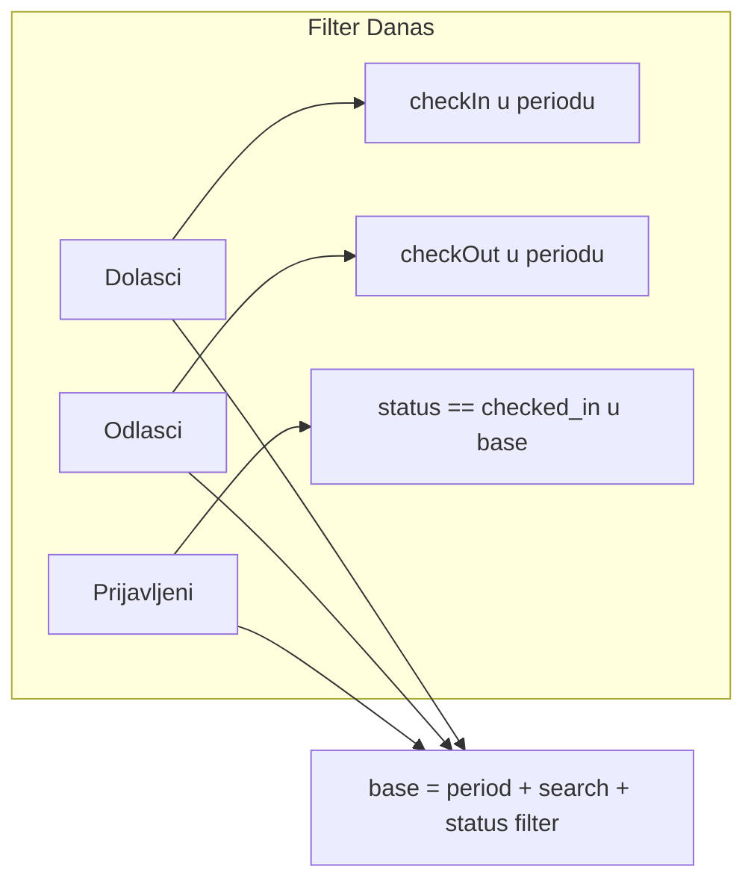

# Timeline: brojač „Prijavljeni”

## Problem

Na filteru **Danas**, kartica **Prijavljeni** pokazuje **0** iako su na listi dvije rezervacije u statusu `checked_in` (npr. odlazak **21.05.** = danas).

Uzrok je u [`timeline_controller.dart`](c:\Users\avrca\Documents\Projects\Uzorita_all\uzorita_flutter\lib\features\reception\presentation\timeline_controller.dart) getter `summary`:

```235:237:c:\Users\avrca\Documents\Projects\Uzorita_all\uzorita_flutter\lib\features\reception\presentation\timeline_controller.dart
    final checkedInCount = base.where((r) {
      return r.status == 'checked_in' && r.checkInDate.compareTo(today) <= 0 && r.checkOutDate.compareTo(today) > 0;
    }).length;
```

Uvjet **`checkOutDate > today`** isključuje goste koji **odlaze danas** — iako su još `checked_in` i vidljivi na listi ([`reservationVisibleOnTimeline`](c:\Users\avrca\Documents\Projects\Uzorita_all\uzorita_flutter\lib\features\reception\presentation\timeline_period_filter.dart) ih uvijek prikazuje).

**Napomena:** Zelena ikona `how_to_reg` na kartici = **eVisitor complete**, ne hotelski check-in. Brojač „Prijavljeni” odnosi se isključivo na `status == 'checked_in'`.



## Odluka (potvrđeno)

- **Prijavljeni** broji iz **`base`** (isti skup kao Dolasci/Odlasci: period + pretraga + status filter, bez canceled po defaultu).
- **Ukloniti** datumske uvjete `checkInDate <= today` i `checkOutDate > today`.
- **Dolasci / Odlasci** — bez promjene.

## Implementacija

### 1. Izdvojiti helper za testabilnost

Nova datoteka npr. [`lib/features/reception/presentation/timeline_summary.dart`](c:\Users\avrca\Documents\Projects\Uzorita_all\uzorita_flutter\lib\features\reception\presentation\timeline_summary.dart):

```dart
int countTimelineArrivals(List<Reservation> base, String lower, String periodEnd) { ... }
int countTimelineDepartures(List<Reservation> base, String lower, String periodEnd) { ... }
int countTimelineCheckedIn(List<Reservation> base) =>
    base.where((r) => r.status == 'checked_in').length;
```

`summary` getter u [`timeline_controller.dart`](c:\Users\avrca\Documents\Projects\Uzorita_all\uzorita_flutter\lib\features\reception\presentation\timeline_controller.dart) delegira na ove funkcije (manji diff, jasna logika).

### 2. Promjena u `summary`

Zamijeniti `checkedInCount` blok s:

```dart
final checkedInCount = countTimelineCheckedIn(base);
```

Ukloniti nekorištenu lokalnu varijablu `today` iz `summary` ako više nije potrebna samo za checked-in (ostaje za `period` / ostalo ako treba).

### 3. Unit testovi

Nova datoteka [`test/features/reception/timeline_summary_test.dart`](c:\Users\avrca\Documents\Projects\Uzorita_all\uzorita_flutter\test\features\reception\timeline_summary_test.dart):

| Scenarij | Očekivano |
|----------|-----------|
| 2× `checked_in`, checkout **danas** | `countTimelineCheckedIn` = **2** |
| 1× `checked_in`, 1× `expected` | **1** |
| 1× `checked_in` checkout jučer | **0** (nije u `base` ako nije u listi — opcionalno, fokus na glavni bug) |

Koristiti postojeći factory iz [`timeline_status_filter_test.dart`](c:\Users\avrca\Documents\Projects\Uzorita_all\uzorita_flutter\test\features\reception\timeline_status_filter_test.dart).

## Test plan (ručno)

| # | Korak | Očekivano |
|---|--------|-----------|
| 1 | Filter **Danas**, 2× `checked_in` s odlaskom danas | **Prijavljeni = 2** |
| 2 | Jedan gost prebaci na **Odjavljen** | Broj se smanji za 1 |
| 3 | Pretraga koja skriva jednu rezervaciju | **Prijavljeni** prati vidljive (base) |
| 4 | **Dolasci / Odlasci** | Isti brojevi kao prije |

## Izvan scopea

- Checkbox za **canceled** u status filteru (zaseban zadatak)
- Promjena backend API-ja
- Brojanje po `evisitor_summary` umjesto `status`

## Datoteke

| Akcija | Datoteka |
|--------|----------|
| Novo | `timeline_summary.dart`, `timeline_summary_test.dart` |
| Izmjena | `timeline_controller.dart` |
